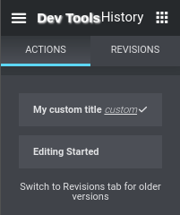
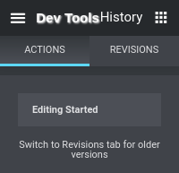

## Component -- `$e.components.get('document/history')`

*  **Name**: History.
*  **Description**: Provide a way to manage history...

## Component `document/history/` -- Commands
| Command                                                                | Access                                             | Description         
|------------------------------------------------------------------------|----------------------------------------------------|-----------------------------------------
| [Add-Transaction](#)                                                   | `$e.run('document/history/add-transaction')`       | 
| [Delete-Log](#)                                                        | `$e.run('document/history/delete-log')`            | 
| [Delete-Transaction](#)                                                | `$e.run('document/history/delete-transaction')`    | 
| [End-Transaction](#)                                                   | `$e.run('document/history/end-transaction')`       | 
| [Log-Sub-Item](#)                                                      | `$e.run('document/history/log-sub-item')`          | 
| [Start-Log](#)                                                         | `$e.run('document/history/start-log')`             | 
| [Start-Transaction](#)                                                 | `$e.run('document/history/start-transaction')`     | 
| [Undo](#)                                                              | `$e.run('document/history/undo')`                  | 
| [Undo-All](#)                                                          | `$e.run('document/history/undo-all')`              | 
| [Redo](#)                                                              | `$e.run('document/history/redo')`                  | 

## _Command_ -- `$e.run('document/histroy/add-transaction')`
*  **Name**: Add-Transaction.
*  **Description**: Add item to transactions.
*  **Returns**: `{void}`
*  **Arguments**: 
TODO: All arguments are optional that is not logical, write explanation of how it works.

    | Property     | Type                  | Requirement   | Description |
    |---           |---                    |---            |---|
    | _container_  | `{Container}`         | **optional**  | Container log.
    | _containers_ | `{Array.<Container>}` | **optional**  | Containers log.
    | _title_      | `{String}`            | **optional**  | Title.
    | _subTitle_   | `{String}`            | **optional**  | Sub title.
    | _restore_    | `{function()}`         | **optional** | Restore function.
*  **Examples**:
TODO

## _Command_ -- `$e.run('document/histroy/delete-log')`
*  **Name**: Delete-Log.
*  **Description**: Delete logged history.
*  **Returns**: `{void}`
*  **Arguments**: 

    | Property     | Type                  | Requirement   | Description |
    |---           |---                    |---            |---|
    | _id_         | `{Number}`            | **required**  | Id of logged history to delete.

*  **Examples**:
    ```javascript
    id = $e.run( 'document/history/start-log', { 
      type: 'custom',
      title: 'My custom title'
    } );
    ```
    Result:
    
    
    ```javascript
    $e.run( 'document/history/delete-log', { id } ); 
    ```
    Result:
    
    
    
## _Command_ -- `$e.run('document/histroy/delete-transaction')`
*  **Name**: Delete-Transaction.
*  **Description**: Delete transaction.
*  **Returns**: `{void}`

## _Command_ -- `$e.run('document/histroy/end-transaction')`
*  **Name**: End-Transaction.
*  **Description**: End transaction, will log the first and the last transaction, as new logged history.
*  **Returns**: `{void}`
*  **Arguments**: None.
*  **Examples**:
